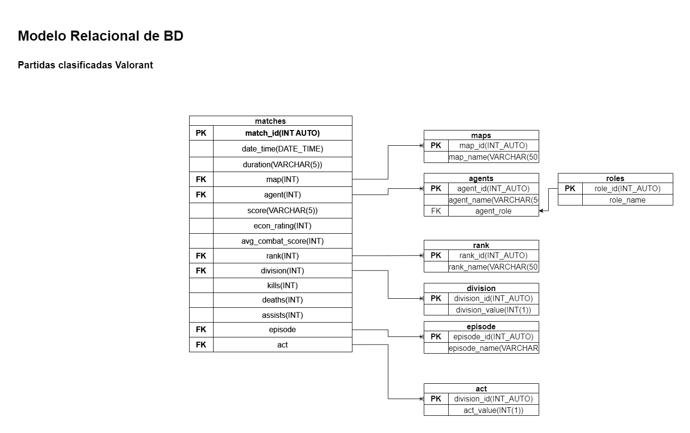

# Partidas Clasificadas

---

### Listado de Entidades

---

### player (**DE**)

- player_id(**PK**)

### matches (**DE**)

- match_id(**PK**)
- date_time
- duration
- map (**FK**)
- agent (**FK**)
- score
- econ_rating
- avg_combat_score
- rank(**FK**)
- division(**FK**)
- kills
- deaths
- assists
- rank
- episode
- act

---

### episode (**EC**)

- episode_id (**PK**)
- name

---

### maps (**EC**)

1. bind
1. haven
1. split
1. ascent
1. icebox
1. breeze
1. fracture
1. pearl
1. lotus

### agents (**EC**)

---

1. astra
1. breach
1. brimstone
1. chamber
1. cypher
1. gekko
1. jett
1. kay/o
1. killjoy
1. neon
1. omen
1. phoenix
1. raze
1. reyna
1. sage
1. skye
1. sova
1. viper
1. yoru

### episodes (**EC**)

---

1. IGNITION 
1. FORMATION
1. REFLECTION
1. DISRUPTION
1. DIMENSION
1. REVELATION

### Relations

---

1. a **match** happens in an **act** (1 to m)
1. an **act** happens in an **episode** (1 to m)
1. a **player** has a **rank** while playing a **match** (1 to 1)
1. a **match** is played **in** a **map** (1 to m)
1. an **agent** is played **in** a match (1 to m)

## Diagrams 

--- 

### Relational Model

